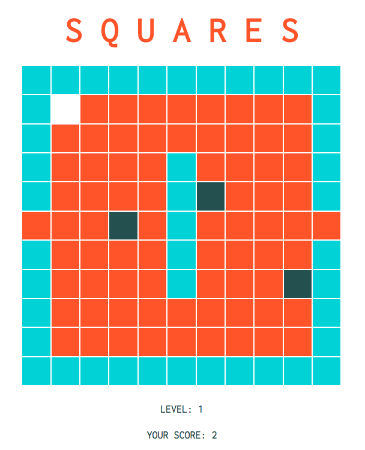

#   WDI Project One: SQUARES

## Brief
Design a grid-based game that works in the user's browser. Players must be able to win and lose. The game should be built using HTML5, CSS3, and Javascript.

## Overview
SQUARES was designed for my first project at General Assembly, and was my first solo attempt at using JavaScript. The game is loosely based on the same concept as Pac-Man, whereby the player (white) must cover all of the red squares while avoiding the randomly moving grey squares, or 'ghosts'

If the player collides with a ghost they are given the option to start again, and if they succeed in covering all of the red squares, they are given the option to play the second level.

Play the game on GitHub Pages [here](https://sophiabarclay.github.io/wdi-project-one/).

## Technologies Used

* HTML5
* CSS
* JavaScript (ECMAScript 6)
* Git
* GitHub
* Google Fonts

## Design
Before deciding on which grid-based game I wanted to create for this project, I researched a number of different options and discovered that the majority of games in this area follow similar design principles: what I refer to as the early-80s arcade aesthetic. In response to the overload of pixellated, neon-on-black observed during this research stage, I opted for the complete opposite, keeping the design stripped-down and minimal, a refreshing change in my opinion.

## Wins and Challenges

### Wins
I had a lot of fun creating the grid system of walls (blue), unvisited squares (red) and visited squares (gold), and am proud of how my logic played out.

### Challenges
Given more time, there is a fair amount of refactoring that I would have liked to complete. This first project clarified the importance of thorough planning and giving myself more time after reaching MVP to trim down my code.

## Future Features
First up on my to do list of improving SQUARES would be to add a scoreboard, allowing users to save scores and compete with other users.

Next, I would like to create additional levels to the game as well as faster moving ghosts as the user progresses through the levels.

Other additional features I could add include bonus point squares and ghost-freezing squares which would appear on the grid for a limited time.
